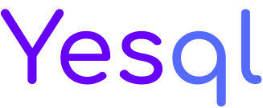
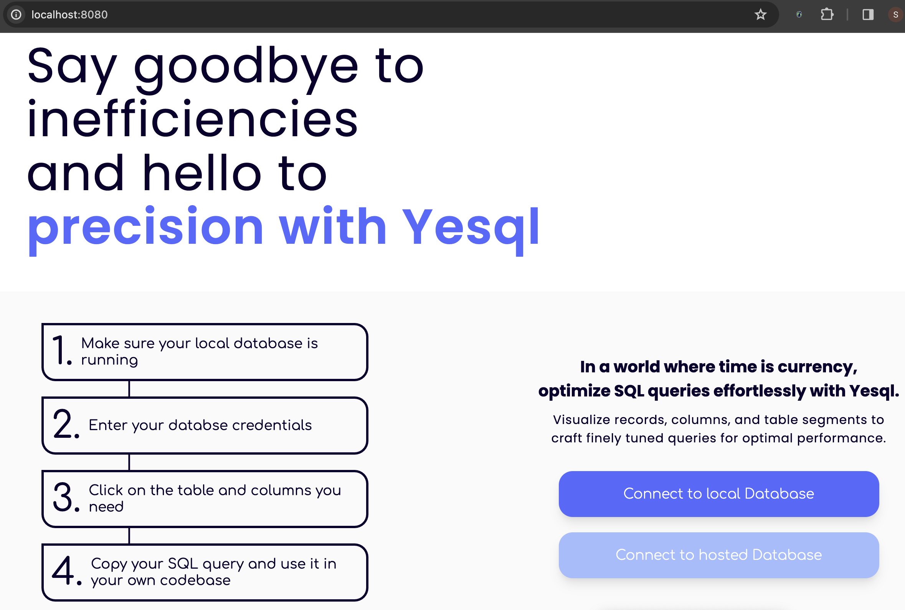
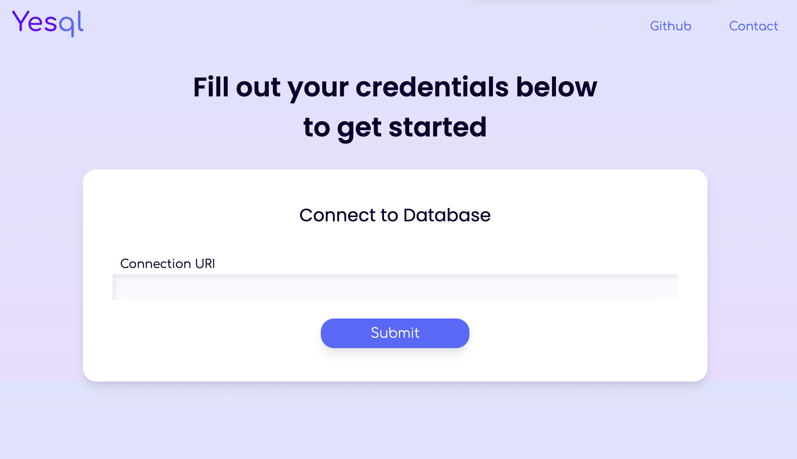
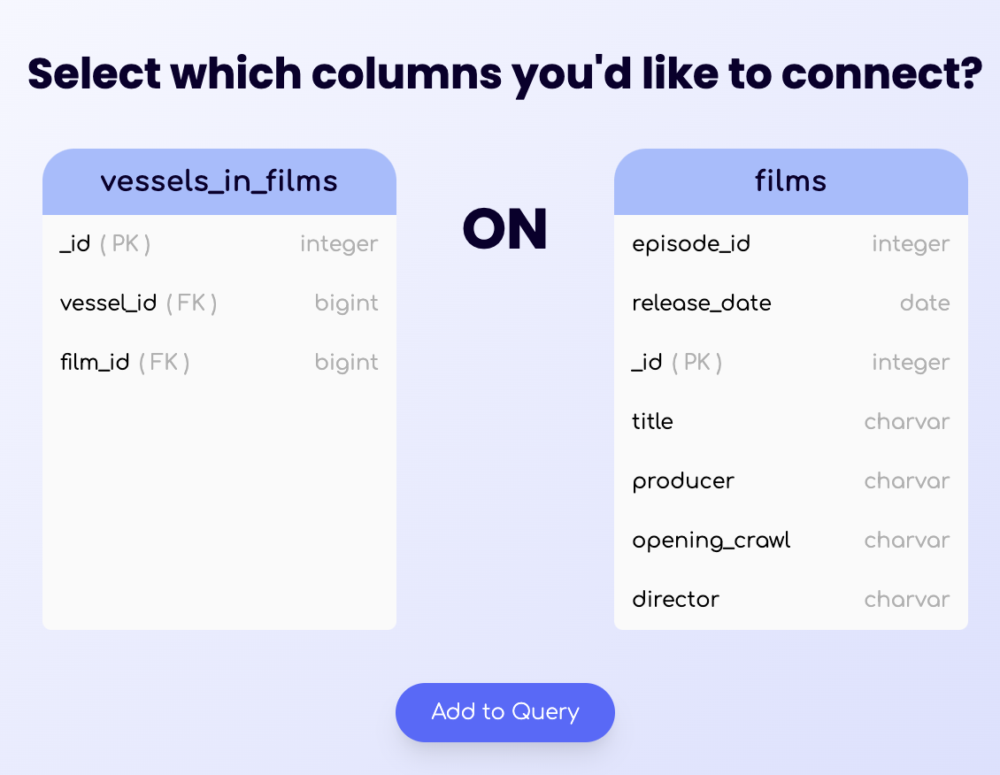

# Yesql

Welcome to Yesql! This application allows you to connect your own PostgreSQL database and optimize your SQL select queries by rendering your database into an interactive entity-relationship diagram (ERD) and testing your results for speed and accuracy. With the confidence that comes from visualizing your entire database and the connections between tables, you will now be able to intuitively craft queries that return precisely the data you need without slowing down your process, and you can copy that query directly into your own codebase. 

## Getting Started

To get started, fork and clone this repository and run “npm install.” 

Start the server by running “npm run build." This should open your browser to localhost.com and you'll see our lovely landing page.

 

If you have a local PostgreSQL database on your machine, ensure your database is running, and then add your connection credentials. 

Alternatively, you can connect via a URI string. 

Once you have submitted your database connection information, you’ll see a beautiful visualization of your database. Have fun dragging the tables around and checking out the relationships between them!

Above your database entity relationship diagram is your query builder. As you click each column to select within a table, this will populate in real time.

If you select columns from separate tables, you'll trigger the option to create a join, along with an explanation of the join table types. 

Select your join type of choice and our join builder will help you construct exactly what you need.

Once you select, you'll see your join has been added to your query!

Feel free to remove columns from your query simply by clicking on them again. Once your query looks the way you want, you're ready to click "Test"!

When you see the "Results" button bounce, your query result is ready. Click that button and check out your query result. Notice on the side you'll see the average length of time it took to return your query so you don't slow down your code execution. 

Click the resulting query string to see a chart with all the data returned from executing your query.

If everything looks the way you want, congrats! Just click that clipboard to copy the query string and paste it into your code. 

## Useful Docs
Here are some useful documentation links that can help you with PostgreSQL databases and more: 
- https://www.postgresql.org/docs/current/intro-whatis.html

## How to Contribute
Yesql is proud to be an open-source product and we welcome contributions! 

To contribute, please follow the following guidelines:
1. Fork and clone this repository.
2. On your local machine, create a new branch titled "YourName/DescriptiveFeatureYouWantToWorkOn."
3. Please include helpful comments in your code to explain what you're doing and why.
4. Push to the dev branch and create a pull request.
5. Profit! (Just kidding)

Here are some stretch features that would make awesome contributions:
- Building out cross-join functionality (the fifth join type in our modal)
- Expanding beyond "SELECT" queries to "INSERT," "UPDATE," and "DELETE." (Note that these queries require modifying the database, so these features will require the application to copy the user's database and run test queries on that copy, so as not to mutate the source data.)

## Contributor Information
- Eleanor Christopher https://www.linkedin.com/in/eleanor-christopher/; https://github.com/LNRtopher
- Ben Jackson https://www.linkedin.com/in/benjaminreidjackson/; https://github.com/Hubbisand
- Sara Kalkstein https://www.linkedin.com/in/sarakalkstein/; https://github.com/RococoKid
- Nina Skyttmo https://www.linkedin.com/in/ninaskyttmo/; https://github.com/NinaSkyttis
- Brian Taylor https://www.linkedin.com/in/brian-c-taylor/; https://github.com/TaylorBC

